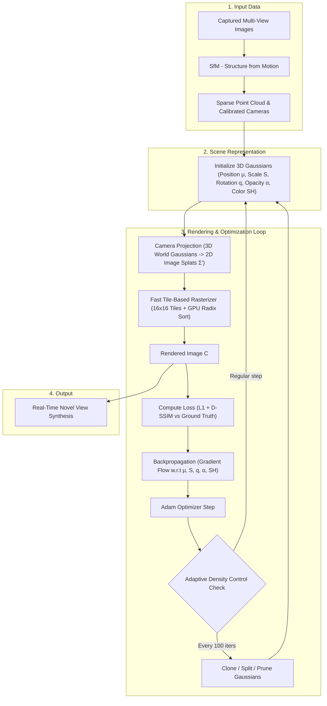
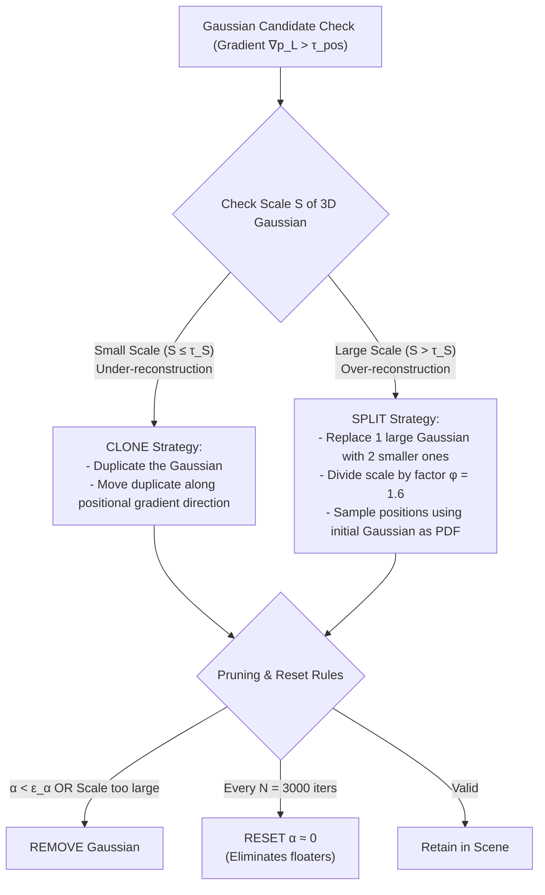
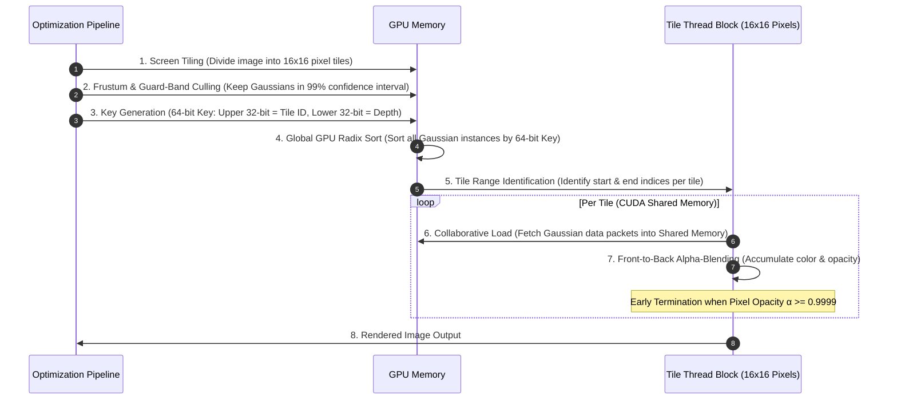

# 3D Gaussian Splatting for Real-Time Radiance Field Rendering

> **Reference Paper:** *3D Gaussian Splatting for Real-Time Radiance Field Rendering* (Kerbl et al., SIGGRAPH / ACM TOG 2023)  
> **Purpose:** Core technical concepts, mathematical formulations, system architecture, and algorithmic design notes for 3D Gaussian Splatting (3DGS).

---

## 1. Overview & Motivation

### 1.1 Challenges in Novel View Synthesis (NVS)
* **NeRF (Neural Radiance Fields):** Uses a continuous implicit scene representation parameterized by a Multi-Layer Perceptron (MLP). While achieving high visual quality, training is extremely slow (up to 48 hours for Mip-NeRF360) and rendering is computationally expensive due to dense stochastic ray-marching sampling along rays.
* **Grid-Based Methods (InstantNGP, Plenoxels):** Utilize voxel or hash grids to accelerate computation. However, they rely on structured grids, wasting memory in empty spaces, and struggle to scale efficiently for large unbounded outdoor scenes at 1080p resolution.
* **Point-Based Rendering (Traditional Splatting):** Uses unstructured point clouds for fast GPU rasterization. However, point rendering suffers from holes, aliasing, and heavily depends on initial Multi-View Stereo (MVS) geometry quality.

### 1.2 The 3D Gaussian Splatting (3DGS) Solution
3DGS combines the advantages of continuous volumetric radiance fields with discrete explicit point-based rendering:
1. **3D Gaussian Scene Representation:** Represents scenes using explicit, unstructured, and differentiable 3D anisotropic Gaussians.
2. **Adaptive Density Control:** Dynamically optimizes Gaussian parameters while adaptively adjusting scene density (cloning, splitting, and pruning points) to populate under-represented areas and split over-extended regions.
3. **Fast Tile-Based Differentiable Rasterizer:** A GPU software rasterizer based on $16 \times 16$ tile bins and fast global GPU Radix Sort, enabling visibility-aware front-to-back alpha-blending with real-time frame rates ($\ge 30-100+$ FPS at 1080p).

---

## 2. System Architecture & Pipeline

The diagram below illustrates the end-to-end pipeline from sparse Structure-from-Motion (SfM) points to rendering and optimization:

---

## 3. Mathematical Formulation of 3D Gaussians

### 3.1 3D Gaussian Primitive Definition
Each 3D Gaussian primitive $i$ is parameterized by five attributes:
1. **Mean / Position:** $\mu \in \mathbb{R}^3$
2. **3D Covariance Matrix:** $\Sigma \in \mathbb{R}^{3 \times 3}$
3. **Opacity:** $\alpha \in [0, 1)$ (constrained via Sigmoid activation)
4. **Spherical Harmonics (SH) Coefficients:** Represents view-dependent color appearance.

The spatial distribution of a 3D Gaussian centered at mean $\mu$ in world space coordinates $x$ is defined as:

$$G(x) = e^{-\frac{1}{2}(x - \mu)^T \Sigma^{-1} (x - \mu)}$$

### 3.2 Covariance Matrix Decomposition
Directly optimizing the covariance matrix $\Sigma$ via gradient descent cannot easily enforce the constraint that $\Sigma$ must remain **Positive Semi-Definite (PSD)**. To guarantee validity, $\Sigma$ is factorized into a Rotation matrix $R$ and a Scaling matrix $S$:

$$\Sigma = R S S^T R^T$$

* **Scale $S$:** Stored as a 3D vector $s \in \mathbb{R}^3$, mapped via an Exponential activation function $S = \text{diag}(e^{s_x}, e^{s_y}, e^{s_z})$.
* **Rotation $R$:** Stored as a normalized **unit Quaternion** $q = (r, x, y, z)$, which converts to a $3 \times 3$ rotation matrix $R(q)$:

$$R(q) = 2 \begin{pmatrix} 
\frac{1}{2} - (y^2 + z^2) & xy - rz & xz + ry \\
xy + rz & \frac{1}{2} - (x^2 + z^2) & yz - rx \\
xz - ry & yz + rx & \frac{1}{2} - (x^2 + y^2)
\end{pmatrix}$$

### 3.3 2D Image Space Projection (Splatting)
To render a 3D Gaussian onto a 2D image plane, the 3D covariance matrix is projected into camera coordinates using an affine approximation (Zwicker et al.):

$$\Sigma' = J W \Sigma W^T J^T$$

Where:
* $W$: World-to-camera viewing transformation matrix (Camera Extrinsics).
* $J$: Jacobian matrix of the affine approximation of the projective transformation.
* The 2D covariance matrix $\Sigma'$ is obtained by skipping the 3rd row and 3rd column of $\Sigma'$, yielding a $2 \times 2$ variance matrix in image space.

---

## 4. Image Formation & Rendering Model

3DGS renders images by evaluating pixel colors through depth-sorted front-to-back alpha-blending:

$$C = \sum_{i \in \mathcal{N}} c_i \alpha_i \prod_{j=1}^{i-1} (1 - \alpha_j)$$

Where:
* $c_i$: View-dependent color computed from the Spherical Harmonics (SH) coefficients of Gaussian $i$ given the ray direction.
* $\alpha_i$: Effective pixel opacity for Gaussian $i$ at pixel coordinate $x$, defined by combining learned per-point opacity $\alpha_i^{\text{base}}$ with the projected 2D Gaussian evaluation $G_{2D}(x)$:

$$\alpha_i = \alpha_i^{\text{base}} \cdot G_{2D}(x)$$

---

## 5. Optimization & Adaptive Density Control

### 5.1 Loss Function
Optimization minimizes a combined loss consisting of an $\mathcal{L}_1$ color loss and a structural similarity loss $\mathcal{L}_{\text{D-SSIM}}$:

$$\mathcal{L} = (1 - \lambda)\mathcal{L}_1 + \lambda \mathcal{L}_{\text{D-SSIM}}$$

Where $\lambda = 0.2$.

### 5.2 Optimization & SH Scheduling
* **Resolution Warm-up:** Training begins at $1/4$ resolution, upsampled to $1/2$ at iteration 250, and full resolution at iteration 500.
* **SH Degree Expansion:** Initially optimizes only degree-0 SH coefficients (diffuse color). Every 1,000 iterations, an additional SH band is introduced until all 4 bands (degree 3) are active.

### 5.3 Adaptive Density Control Strategy
Every 100 iterations (after an initial warm-up phase), the density controller identifies Gaussians with large view-space positional gradients $\nabla_{p_L} > \tau_{\text{pos}} = 0.0002$.

#### Operations Summary:
1. **Clone:** Applied to **Under-reconstructed** regions (small Gaussians missing geometry). Copies the Gaussian and shifts it along the view-space gradient vector.
2. **Split:** Applied to **Over-reconstructed** regions (overly large Gaussians covering fine details). Replaces the large Gaussian with two smaller ones, scaling down their extent by $\phi = 1.6$ and sampling their positions using the original Gaussian as a PDF.
3. **Prune & Reset Opacity:** Removes Gaussians with opacity below threshold $\epsilon_{\alpha}$ or scales exceeding scene bounds. Opacity values $\alpha$ are reset to near zero every $N = 3000$ iterations to prune unnecessary "floaters".

---

## 6. Fast Tile-Based Differentiable GPU Rasterizer

The GPU rasterizer accelerates rendering using tile-based binning and efficient CUDA memory layouts:

### Rasterizer Execution Steps:
1. **Screen Tiling:** Splits the screen into $16 \times 16$ pixel tiles.
2. **Frustum Culling:** Rejects Gaussians outside the 99% confidence interval of the view frustum or near extreme camera bounds.
3. **Instance Key Creation:** Generates a 64-bit sorting Key per tile-overlapping Gaussian instance (Upper 32 bits = Tile ID, Lower 32 bits = View-space Depth).
4. **Fast GPU Radix Sort:** Sorts all Gaussian instances across the entire screen in a single GPU Radix Sort pass.
5. **Tile Range Setup:** Identifies per-tile start/end array indices by comparing neighboring keys.
6. **Parallel Front-to-Back Rasterization:** Each tile launches a CUDA thread block. Threads cooperatively load Gaussian packets into Shared Memory and evaluate front-to-back alpha-blending per pixel.
7. **Early Termination:** Thread execution for a pixel terminates as soon as its accumulated opacity reaches saturation ($\alpha \ge 0.9999$).
8. **Visibility-Aware Backward Pass:** Traverses sorted tile lists Back-to-Front during gradient computation, recovering intermediate opacities directly from the final accumulated opacity without dynamic memory overhead.
