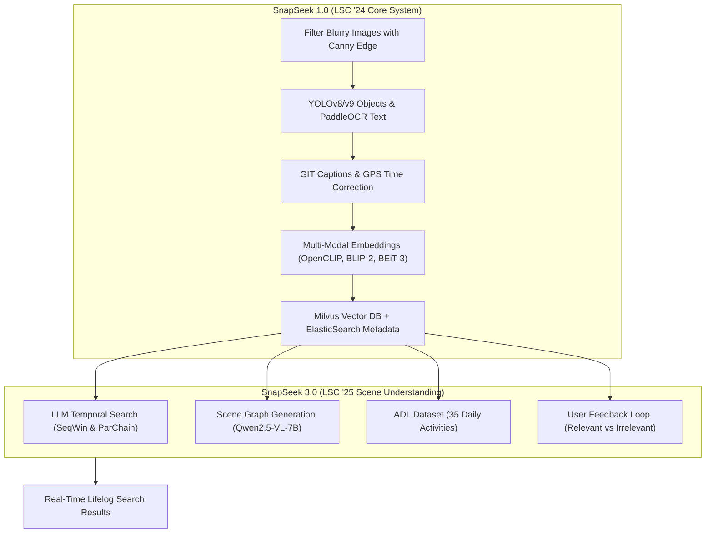
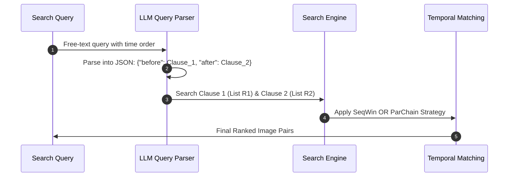

# Overview Notes: Autonomous & Interactive Lifelog Retrieval (SnapSeek 1.0 & SnapSeek 3.0)

> **References:**  
> - **SnapSeek 1.0:** *SnapSeek: An Interactive Lifelog Acquisition System for LSC’24* (Ho-Le et al., LSC '24)  
> - **SnapSeek 3.0:** *SnapSeek 3.0: Interactive Lifelog Search System with Enhanced Scene Understanding* (Ho-Le et al., LSC '25)

---

## 1. What is Lifelog Retrieval?

* **Lifelogging:** The process of automatically recording daily life experiences using wearable cameras (such as Narrative Clip) and sensors (GPS, timestamp).
* **Main Challenges:**
  1. **Huge Data Volume:** Millions of images, videos, locations, and timestamps.
  2. **Data Noise:** Many blurry, dark, or meaningless photos.
  3. **Complex Queries:** User queries often describe actions over time, object relationships, and daily activities rather than simple keywords.

---

## 2. System Evolution: SnapSeek 1.0 vs 3.0

---

## 3. SnapSeek 1.0 (LSC '24): Core Search System

### 3.1 Data Pre-processing Pipeline
1. **Remove Bad Images:** Uses **Canny Edge Detection** to remove dark, blurry, or useless photos.
2. **Detect Objects:** Uses **YOLOv8** (600 classes) and **YOLOv9** (79 classes) to tag objects in photos (such as chairs, cars, phones).
3. **Read Scene Text (OCR):** Uses **PaddleOCR** to read text in photos and replace brand names with common nouns (e.g., "carex" $\rightarrow$ "hand sanitizer").
4. **Generate Captions:** Uses **GIT (GenerativeImage2Text)** model to write short image descriptions.
5. **Fix Time Zones:** Adjusts timestamps using GPS location data when traveling across countries.
6. **Recognize Activities:** Groups keyframes into events and tags activity types using the **Text4Vis** model.

### 3.2 Indexing & Search Engine
* **Vector Search (Milvus DB):** Stores image embeddings from **OpenCLIP**, **BLIP-2**, and **BEiT-3**, plus text embeddings from Sentence Transformer (`all-mpnet-base-v2`).
* **Text Search (ElasticSearch):** Stores text metadata like locations, date/time, OCR text, and object tags.
* **Auto-Parsing Queries:**
  - Uses **POS Tagging** for object nouns.
  - Uses **SpaCy NER** for location names.
  - Uses Regex for date and time.
* **Combined Ranking:** Merges vector similarity scores and text metadata scores using the **Harmonic Mean** formula:

$$\text{Harmonic Mean} = \frac{n}{\sum_{i=1}^{n} \frac{1}{x_i}}$$

---

## 4. SnapSeek 3.0 (LSC '25): Advanced Features

SnapSeek 3.0 adds 4 main upgrades for complex search queries:

### 4.1 Temporal Search (Searching Sequences of Events)
When a query asks for events in a specific order (for example: *"holding a phone before paying cash"*):

#### Two Matching Strategies:
1. **SeqWin (Sequential Windowing):**
   - For events happening **right after each other** (short time gap).
   - Looks for Clause 2 inside a sliding time window right after Clause 1.
2. **ParChain (Parallel Chain Aggregation):**
   - For events with **longer time gaps** (for example: *"arriving at the airport before boarding the plane"*).
   - Groups continuous images into context blocks and pairs matching context blocks.

---

### 4.2 Scene Graph Generation
Simple object tags cannot show how objects interact. SnapSeek 3.0 uses **Qwen2.5-VL-7B** (Multimodal LLM) to create a **Scene Graph** with 3-part tuples `(subject, predicate, object)`:
* **Subject:** Main object (e.g., `person`).
* **Predicate:** Action or spatial relation (e.g., `hold`, `be on`, `be next to`).
* **Object:** Target object (e.g., `book`, `table`).

*Example:* `(person, hold, book)` is different from `(book, be on, table)`.  
These tuples are converted to text, encoded by CLIP, and saved in Milvus for relation-aware search.

---

### 4.3 ADL Annotations (Activities of Daily Living)
* Uses **35 common daily activity labels** (such as `working at home`, `using a computer`, `eating`, `driving`).
* Built using semi-automatic clustering and human review.
* Helps quickly filter photos when user queries are vague or ambiguous.

---

### 4.4 Human-in-the-Loop Feedback
Allows users to click photos during search to improve results in real time:
* **Relevant ($A^+$):** Finds similar images and brings them to the top.
* **Irrelevant ($A^-$):** Removes bad or wrong photos.
* Formula to update results:

$$A \leftarrow (A \cup A^+) \setminus A^-$$
